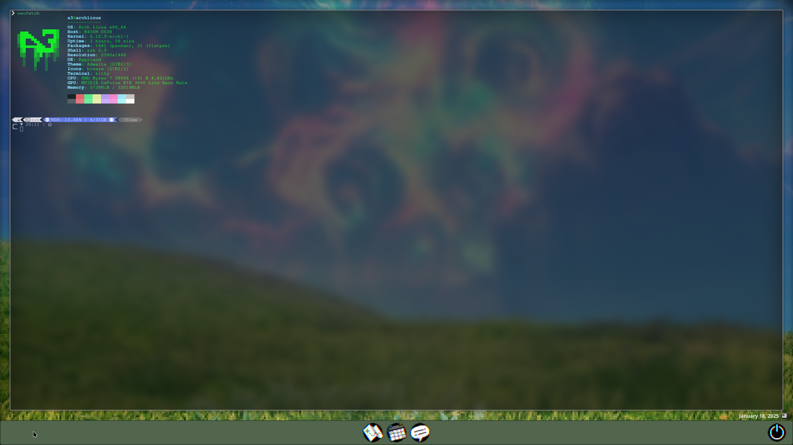

# Warframe 1999 Theme for Waybar

A custom Waybar theme inspired by the aesthetics of Warframe 1999. This theme integrates various visual elements designed to resemble the Warframe UI style and provides a unique, futuristic look to your Waybar setup.



> If you're new to Linux, please refer to the [INTRO.md](./INTRO.md) file first to get familiar with the basics of Linux and Hyprland setup before diving into this theme installation guide.

## Requirements

Before installing the Warframe 1999 theme, you will need the following:

- **Hyprland**: A dynamic tiling Wayland compositor.
- **Waybar**: A highly customizable bar for Wayland.
- **NWG Wrapper**: A wrapper for managing custom widgets and scripts for Waybar.
- **The `warframe-1999-theme` repository**: This repository contains the theme files and configurations.
- **Optional - `ml4w` Dotfiles**: For easier setup, you can use the `ml4w` dotfiles, which include pre-configured settings for Waybar, Hyprland, and other components.

Make sure you have the following installed:

1. **Hyprland**: Install Hyprland by following the instructions on their [GitHub page](https://github.com/hyprwm/Hyprland).
   
2. **Waybar**: Install Waybar via your package manager or from source. Instructions can be found on the [Waybar GitHub page](https://github.com/Alexays/Waybar).

3. **NWG Wrapper**: Install NWG Wrapper, which provides extra scripts. You can find more information and installation instructions on the [NWG Wrapper GitHub page](https://github.com/nwg-piotr/nwg-wrapper).

4. **The Repository**: Download or clone this repository to get the necessary theme files:
   ```bash
   git clone https://github.com/A3ABS/warframe-1999-theme.git
   ```

5. **Optional - `ml4w` Dotfiles**: For easier setup, you can install the `ml4w` dotfiles, which provide pre-configured settings for Hyprland and Waybar. This step is optional but recommended for a quicker configuration.

---

## Installation

### 1. Clone the Repository

Clone the repository to your local machine:

```bash
git clone https://github.com/A3ABS/warframe-1999-theme.git
cd warframe-1999-theme
```

### 2. Install Dependencies

Ensure the following software is installed on your system:

- **Hyprland** (as the compositor)
- **Waybar**
- **NWG Wrapper**

You can install them via your package manager or follow the installation guides from their respective GitHub pages.

### 3. Install `ml4w` Dotfiles (Optional)

To make the setup easier, you can install the `ml4w` dotfiles, which provide pre-configured settings for Hyprland and Waybar. These dotfiles include:

- Pre-configured **Waybar settings**.
- Custom **Hyprland configuration**.

Install them with the following instructions here:

```bash
https://github.com/mylinuxforwork/dotfiles
```

Once the `ml4w` dotfiles are installed, you can use the `ml4w config change tool` to modify settings easily. This tool will automatically update the configuration files for Hyprland and Waybar, including all required changes to make the Warframe theme work seamlessly.

### 4. Copy the Files

Copy all the necessary files to your Waybar configuration directory:

```bash
cp -r * ~/.config/waybar/
```

### 5. Customize the Image Path  

By default, the theme uses the image `RetroCalendarFavicon.png`, which should be placed in the same directory as the `date.sh` and `pic.sh` scripts.

Make sure to update the `image_path` variable in the `pic.sh` script with the absolute path to the image. For example:

```bash
# Update the image path with the absolute path to RetroCalendarFavicon.png
image_path="/full/path/to/RetroCalendarFavicon.png"
```

### 6. Install and Use NWG Wrapper

To manage widgets and scripts for your Waybar, use **NWG Wrapper**. Follow these steps:

1. Install **NWG Wrapper** via your package manager or follow the [GitHub instructions](https://github.com/nwg-piotr/nwg-wrapper).

2. Run the following commands, replacing the paths with your system paths:

```bash
nwg-wrapper -s /full/path/to/date.sh -p right -mr 35 -a end -mb -8 -j right
nwg-wrapper -s /full/path/to/pic.sh -p right -mr 0 -a end -mb -12 -j right
```

### Explanation of Commands:

- `-s /full/path/to/date.sh`: Full path to your `date.sh` script.
- `-p right`: Positions the widget on the right (`left`, `center` are other options).
- `-mr 35`: Moves widget 35px from the right edge.
- `-a end`: Aligns the widget to the end (left or right).
- `-mb -8`: Sets a bottom margin of -8px.
- `-j right`: Justifies the widget to the right.

### How to Tweak:

- **Position** (`-p left`, `-p right`, `-p center`): Adjust widget's position.
- **Margins** (`-mr`, `-mb`): Modify spacing between the widget and edges.
- **Justification** (`-j right`, `-j left`): Controls widget alignment.

## Note

If you encounter any issues, your best friend is an AI like ChatGPT—use it to troubleshoot and refine your setup.

### Autostart Recommendation

To ensure NWG Wrapper runs automatically on startup, add the commands to your **autostart script**. This way, you won’t need to run them manually each time.

### Visibility Issues

If the widgets are hidden behind open windows, adjust the **window gaps out** in the **ml4w Hyprland settings application** to make them visible.

### 7. Restart Waybar

After setting everything up with NWG Wrapper, restart Waybar to apply the changes:

```bash
# Restart Waybar
pkill waybar
waybar &
```

## Usage

Once the theme is installed, Waybar will automatically use the custom theme. You can modify the `config` and `style.css` files to suit your preferences.

For customizations:
- Adjust the layout in the `config` file.
- Modify the look and feel using the `style.css` file.
- Change the image path if you're using your own icons.

## License

This project is licensed under the MIT License - see the [LICENSE](./LICENSE) file for details.